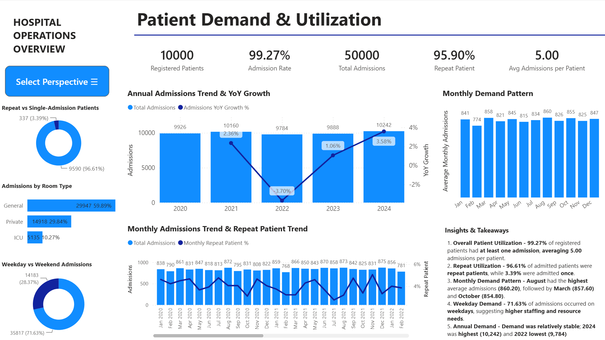
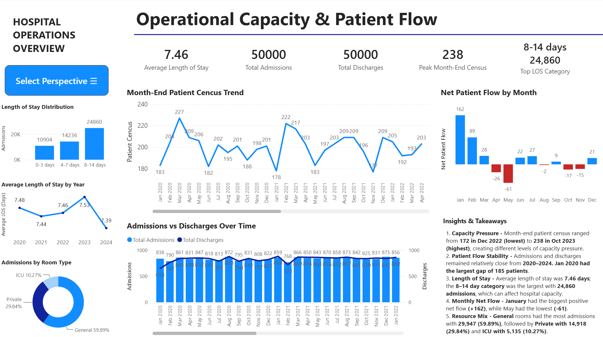
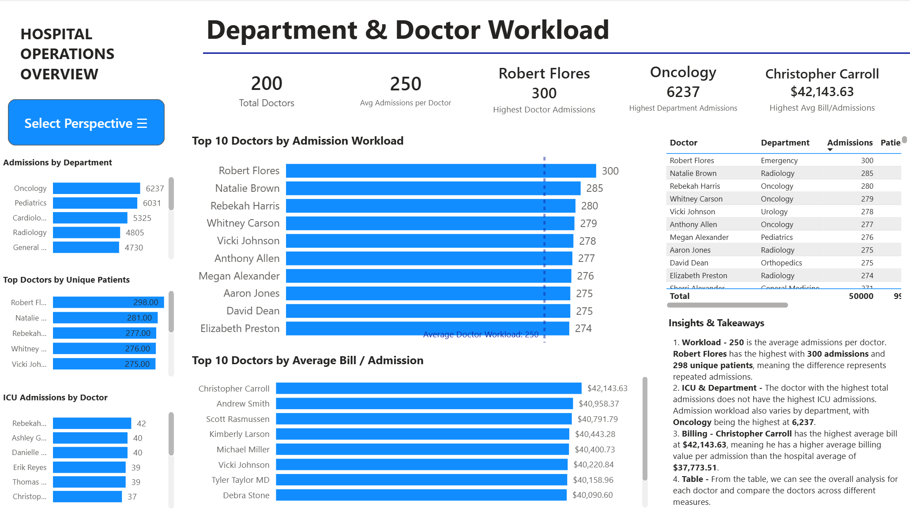
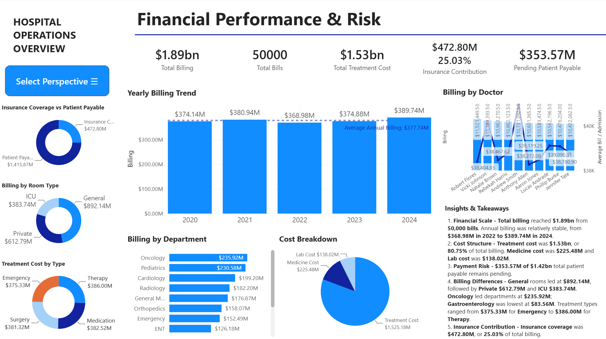
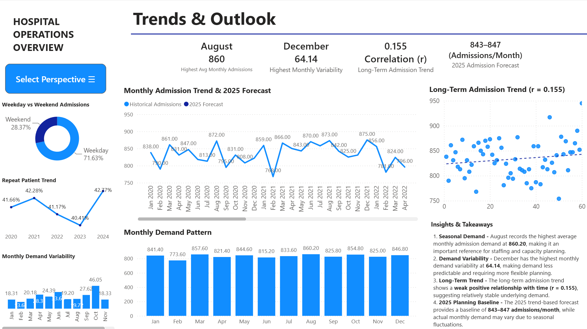

# **Hospital Management Analysis**
**Excel, SQL & Power BI | Insights into Patient Demand, Operations, Workload, Financial Performance, Trends and Future Outlook**

[](https://www.microsoft.com/microsoft-365/excel)
[](https://www.postgresql.org/)
[](https://powerbi.microsoft.com/)

---

## **Project Overview**
This project analyzes **the Hospital Management dataset (2020-2024)** to identify and understand patient demand, operational performance, doctor workload, financial performance, trends and future outlook.

Final insights are presented through a Power BI dashboard to support decision-making in capacity planning and operations.

---

## **Problem Statement**
The hospital needs accurate and actionable data analysis for patient demand, operational performance, doctor workload, financial performance, trends and future outlook to optimize capacity, staffing and scheduling.

This project explores various analyses to provide a better understanding of this dataset.

---

## **Dataset**
- Source: [Hospital Management Dataset](https://www.kaggle.com/datasets/garimakochale/hospital-management-dataset)
- Time period: 2020-2024
- Key tables: Patients, Admissions, Doctors, Departments, Treatment, Billing and Calendar.

---

## **Tools Used**

Excel Cloud:
- Data cleaning
- Preparation

VS Code:
- SQL script development
- Project organization

PostgreSQL / pgAdmin 4:
- SQL data validation
- Transformation
- Analysis

Power BI:
- Interactive dashboard
- KPI visuals
- Data visualization

---

## **Methodology**
- Create roadmap, phase and plan
- Understanding the dataset
- Data cleaning and preparation using Excel
- Schema design, create tables and load data
- Module 1 - Patient Flow Analysis
- Module 2 - Department Performance
- Module 3 - Hospital Stay Analysis
- Module 4 - Cost, Insurance & Payment Analysis
- Module 5 - Doctor Performance & Workload
- Module 6 - Trend & Time Analysis
- Executive Summary
- Power BI data modeling and mapping
- DAX measures and KPIs
- Dashboard development
- Technical QA and validation

---

## **Key Insights**

### 1. Patient Demand & Utilization
- **Patient Utilization:** 99.27% had at least one admission, averaging 5.00
- **Repeat Utilization:** 96.61% repeat patients, 3.39% admitted once
- **Monthly Demand:** August 860.20 (highest), March 857.60 and October 854.80
- **Weekday Demand:** 71.63% weekdays
- **Annual Demand:** 2024 10,242 (highest) and 2022 9,784 (lowest)

### 2. Operational Capacity & Patient Flow
- **Census:** 172 in Dec 2022 (lowest) → 238 in Oct 2023 (highest)
- **Admissions/discharges:** largest gap was Jan 2020 at 185
- **Length of Stay:** 7.46 days, with 8–14 days being the largest category at 24,860
- **Net Flow:** January +162 (highest), May -61 (lowest)
- **Room Type:** General 29,947 (59.89%), Private 14,918 (29.84%), ICU 5,135 (10.27%)

### 3. Department & Doctor Workload
- **Workload:** 250 average admissions/doctor; Robert Flores 300 admissions (highest) and 298 unique patients, the difference represents repeated admissions
- **ICU & Department:** The doctor with the highest total admissions does not have the highest ICU admissions. Admission workload varies by department, Oncology 6,237 (highest)
- **Billing:** Christopher Carroll's average bill of $42,143.63 (highest), meaning he has a higher average billing value per admission than the hospital average of $37,773.51

### 4. Financial Performance & Risk
- **Financial Scale:** Total billing $1.89bn from 50,000 bills. Annual billing was relatively stable, $368.98M in 2022 → $389.74M in 2024
- **Cost Structure:** Treatment cost $1.53bn, 80.75% of total billing. Medicine cost $225.48M and Lab cost $138.02M
- **Payment Risk:** $353.57M of $1.42bn total patient payable remains pending
- **Billing Differences:** General rooms $892.14M (highest), Private $612.79M and ICU $383.74M. Oncology $235.92M (highest) and Gastroenterology $83.56M (lowest). Treatment types ranged $375.33M for Emergency to $386.00M for Therapy
- **Insurance Contribution:** Insurance coverage was $472.80M, 25.03% of total billing

### 5. Trends & Outlook
- **Seasonal Demand:** August 860.20 (highest)
- **Demand Variability:** December 64.14 (highest), making demand less predictable and requiring more flexible planning
- **Long-Term Trend:** The long-term admission trend shows a weak positive relationship with time (r = 0.155)
- **2025 Planning Baseline:** The 2025 trend-based forecast provides a baseline of 843–847 admissions/month, while actual monthly demand may vary due to seasonal fluctuations
   
---

## **Business Impact**

These insights are translated into operational recommendations for hospital management.

- Helps hospital **plan capacity** during peak patient demand
- Helps optimize **staffing, scheduling decisions and resource allocation**
- Helps prepare for **seasonal fluctuations or variability in advance**
- Helps reduce risk of **overcapacity** and **undercapacity**
  
---

## **Project Structure**

```text
hospital_management_analysis/
├── assets/
│   ├── images/
│   └── pdf/
├── data/
│   ├── clean/
│   ├── processed/
│   └── raw/
├── powerbi/
│   └── hospital_management_analysis.pbix
├── scripts/
│   ├── check_clean_csv.py
│   └── extract_excel_to_csv.py
├── sql/
│   ├── 01_schema_design.sql
│   ├── 02_create_tables.sql
│   ├── 03_load_data.sql
│   ├── 04_module_01_patient_flow.sql
│   ├── 05_module_02_department_performance.sql
│   ├── 06_module_03_hospital_stay.sql
│   ├── 07_module_04_cost_insurance_payment.sql
│   ├── 08_module_05_doctor_performance.sql
│   ├── 09_module_06_trend_time.sql
│   └── 10_executive_summary.sql
└── README.md
```

---

## **Future Improvements**

- Include **automated data refresh** to make the dashboard dynamic with the latest data
- Include **real-time operational monitoring** for timely decision-making
- Perform **advanced demand forecasting** for future planning
- Include **additional operational and financial KPIs** to gain more insights for better understanding

---

## **Power BI Dashboard**

Final results are visualized through a Power BI dashboard to support interactive exploration of trends and forecasts

### Patient Demand & Utilization


### Operational Capacity & Patient Flow


### Department & Doctor Workload


### Financial Performance & Risk


### Trends & Outlook


Click on the Power BI file in the `powerbi/` folder to explore the interactive dashboard.

---

## **Conclusions**
- Successfully analyzed the hospital management dataset from 2020–2024 using Excel, SQL and Power BI
- The analysis provides a better understanding of hospital patient demand, operations, doctor workload, financial performance, trends and future outlook.
- As a result, the analysis supports hospital management with capacity planning, staffing, resource allocation and future planning.
